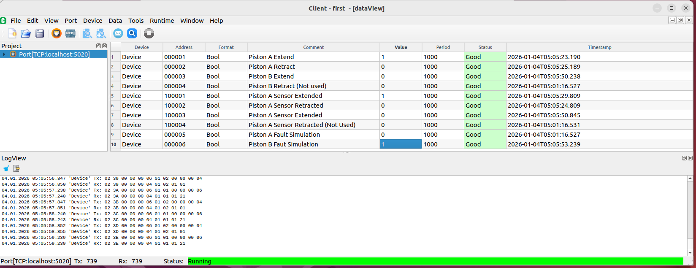

## Index
- [Overview](#overview)
- [Why Use This Simulator](#why-use-this-simulator)
- [Features](#features)
- [Visualization & Interaction](#visualization--interaction)
- [Getting Started](#getting-started)
- [Running the Simulator](#running-the-simulator)
- [Excel Configuration](#excel-configuration)
- [Why Excel?](#why-excel)
- [GitHub Repository](#github-repository)
- [License](#license)
- [Example: Two Pistons Configuration](#example-two-pistons-configuration)


## Overview

The **Multi-Piston Simulator** is a modular Python project designed to **simulate industrial piston systems** with realistic control, sensors, and fault behavior. It is aimed at engineers, researchers, and students who want to **understand, test, or demonstrate automation concepts** without physical hardware.  

This simulator is particularly useful for:

- **Education**: visualizing the dynamics of pistons, sensors, and commands in real time.
- **Research & Development**: testing PLC logic, Modbus communication, or control algorithms.
- **Prototyping**: quickly iterating piston configurations before moving to real hardware.

---

## Why Use This Simulator

- **Safe and fast experimentation**: test different piston configurations, command strategies, and faults without risk or cost.
- **Fully configurable via Excel**: change number of pistons, strokes, sensors, and control modes in seconds.
- **Visual feedback**: intuitive visualization of pistons, rods, sensors, and commands.
- **Modular and extendable**: easy to integrate PLC logic, Modbus interfaces, or new simulation features.
- **Consistency across simulations**: all pistons share the same scaling and behavior, making comparisons reliable.
- **Fault simulation included**: block pistons to test emergency response, logic handling, or PLC reaction.

This makes it ideal for anyone looking to **learn automation, validate control logic, or showcase industrial simulation skills**.

---

## Features

- Multi-piston simulation with independent movement.
- Extend and retract commands with single or double command modes.
- Endstop sensors with color indicators (green = active, red = inactive).
- Fault simulation (blocking pistons).
- Labels for each piston, fully configurable via Excel.
- Real-time animation using Matplotlib.
- Optional Modbus TCP interface for external control and monitoring.

---

## Visualization & Interaction

The simulator provides clear visual feedback for each piston:

- **Cylinder and rod**: motion accurately reflects stroke configuration.
- **Piston head**: moves with rod to show current position.
- **Endstop sensors**: indicate whether pistons are fully retracted or extended.
- **Command indicators**: show which commands are active in real time.
- **Fault indicators**: simulate blocked pistons for testing emergency response.

This makes it possible to **observe control logic and physical response simultaneously**, bridging the gap between theory and practice.

---

## Getting Started

### Requirements

- Python 3.8+
- Libraries: `pandas`, `matplotlib`, `openpyxl`, `pyModbusTCP` (if using Modbus)
- Excel for configuration

Install dependencies:

```bash
pip install pandas matplotlib openpyxl pyModbusTCP
```

---

## Running the Simulator

Clone the repository:

```bash
git clone https://github.com/aa9772/piston-sim.git
cd piston-sim
```

Run the simulator with the default configuration:

```bash
python -m piston_sim.main
```

Or specify a custom Excel file:

```bash
python -m piston_sim.main path_to_your_excel.xlsx
```

---

## Excel Configuration

Pistons are fully configurable via Excel. Configure:

| Column                | Description                       |
| --------------------- | --------------------------------- |
| ID                    | Piston identifier                 |
| Label                 | Displayed label above piston      |
| Stroke                | Maximum piston extension          |
| Sensor Retract        | 'Yes' or 'No'                     |
| Sensor Extend         | 'Yes' or 'No'                     |
| Single/Double Command | 'Single' or 'Double' command mode |
| Speed                 | Optional, piston movement speed   |

---

## Why Excel?


- Non-technical users can change piston setup without editing code.
- Quick experimentation with different numbers of pistons or stroke lengths.
- Easily integrates with PLC and Modbus simulation logic.

---

## GitHub Repository

Full source code, releases, and updates are available on GitHub:

[https://github.com/aa9772/piston-sim](https://github.com/aa9772/piston-sim)

---

## License

This project is licensed under the MIT License.

---

## Example: Two Pistons Configuration

We will simulate **two pistons** with different setups:

### Piston Configurations

1. **Piston A**  
   - Double Command  
   - Both sensors are present  
   - *This piston can extend and retract independently, with full sensor feedback.*

2. **Piston B**  
   - Single Command  
   - Only the extended sensor is present  
   - *This piston only detects the extended position, limiting control options.*

You can see the Excel configuration file here:  
[Download Piston Configuration](pistons_config.xlsx)  
*This file contains the setup parameters for each piston, including command type and sensor presence.*

**Output of the configuration:**  
  
*Diagram showing how the pistons are configured according to the Excel file.*

---

### Modbus Master Setup

- IP: localhost (or 127.0.0.1)
- Port: 5020

We use **ModbusTools** as the Modbus Master:  
[ModbusTools](https://github.com/serhmarch/ModbusTools/)  
*This software simulates a Modbus client to control the pistons.*

**Client configuration file:**  
[Download Client Configuration](2PistonsModubsMaster.xml)  
*Contains the mapping of Modbus addresses and commands for each piston.*

**Client GUI Screenshot:**  
  
*Shows the Modbus client interface with pistons listed and ready to be controlled.*

---

### Execution Example: Piston A Extension

  
*This screenshot shows Piston A extending under Modbus command, verifying that sensors respond correctly.*

**Result:**  
  
*Graphical output of Piston A’s motion and sensor feedback over time.*

---

### Fault Simulation

**Modbus Fault Simulation:**  
  
*Demonstrates a simulated Modbus fault during piston operation.*

**Fault Result:**  
  
*Shows how the system reacts to the fault, including sensor and command status.*
